# liman kılavuzu

liman, Nautilus ya da Dolphin gibi bir dosya yöneticisini terminale taşır: klasörler kutu kutu görünür, fareyle tıklanır,
sürüklenir; ama SSH ve tmux içinde de çalışır ve altında gerçek bir terminal vardır.

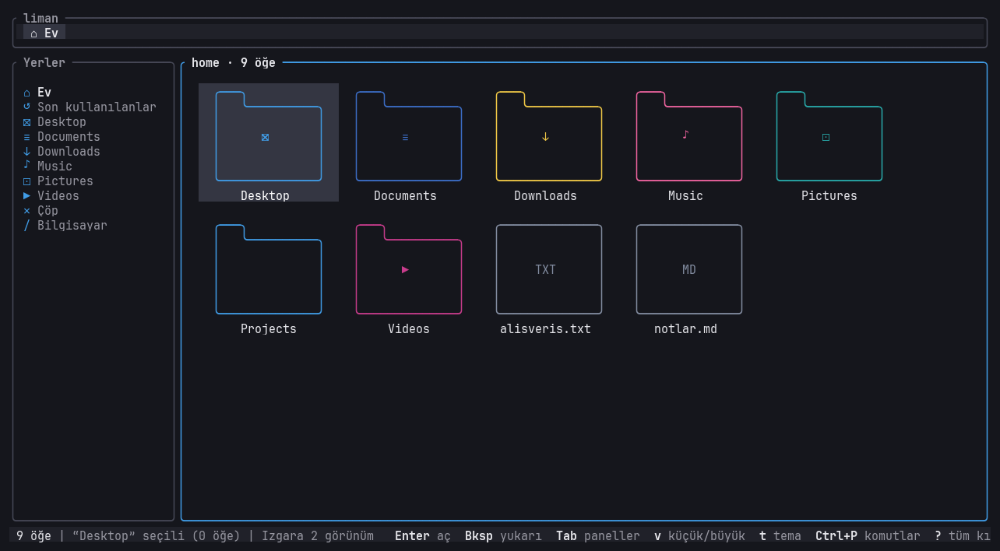

> Bu kılavuzdaki ekran görüntüleri uydurma bir ev klasöründe (`/tmp/liman-demo`) otomatik çekilir:
> `python3 fm-research/research/spikes/ekran/cek.py` hepsini yeniden üretir.

İçindekiler:
[Kurulum ve açma](#kurulum-ve-açma) ·
[Ekranın parçaları](#ekranın-parçaları) ·
[Görünümler](#görünümler) ·
[Gezinme](#gezinme) ·
[Seçme](#seçme) ·
[Dosya işlemleri](#dosya-işlemleri) ·
[Arama ve süzme](#arama-ve-süzme) ·
[Önizleme ve okuyucu](#önizleme-ve-okuyucu) ·
[Terminal](#terminal) ·
[Sekmeler](#sekmeler) ·
[Git](#git) ·
[Komut paleti ve sağ tık](#komut-paleti-ve-sağ-tık) ·
[Renkler ve temalar](#renkler-ve-temalar) ·
[Ayarlar](#ayarlar) ·
[Tüm kısayollar](#tüm-kısayollar)

---

## Kurulum ve açma

```sh
cd ~/Projects/liman && cargo install --path crates/liman   # kur / güncelle
liman                                                       # bulunduğun klasörde açar
```

- Uygulama başlatıcısında (Hyprland'de rofi/wofi vb.) **liman** yazınca kitty içinde açılır
  (`contrib/liman.desktop`, kopyası `~/.local/share/applications/liman.desktop`).
- Sunucuya kurmak için (repo herkese açıldığında): `curl -fsSL https://raw.githubusercontent.com/WertC-14/liman/main/install.sh | sh`
- `liman --version`, `liman --help`. Çıkmak: **q**.

## Ekranın parçaları

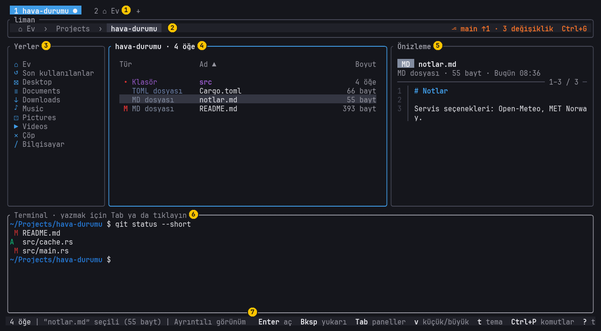

1. **Sekme satırı** — yalnızca iki ya da daha çok sekme varken görünür.
2. **Yol çubuğu** — bulunduğun klasör, her parça tıklanabilir. Sağda git deposundaysan dal ve değişiklik sayısı.
3. **Yerler** — Ev, Son kullanılanlar, yer imleri (★), Çöp, Bilgisayar ve sistem klasörlerin (Belgeler, İndirilenler...).
4. **Dosyalar** — çerçevenin başlığında klasör adı ve öğe sayısı.
5. **Önizleme** (F3) — sağda, seçili öğenin içi.
6. **Terminal** (F4) — altta, gerçek kabuğun.
7. **Durum çubuğu** — öğe sayısı, seçili öğe, işaretliler, mesajlar ve en çok kullanılan tuşlar.

Odak hangi paneldeyse onun çerçevesi mavi olur. **Tab / Shift+Tab** odağı Yerler → Dosyalar → Önizleme → Terminal arasında
gezdirir; kapalı paneller atlanır (Tab terminali ya da önizlemeyi açmaz).

## Görünümler

| Görünüm | Ne | Nasıl |
|---|---|---|
| **Izgara** | İçi boş, türüne göre renkli kutular, altta ad | varsayılan |
| **Normal** | Satır başına küçük kutu + ad, boyut, tarih | **-** ile küçült |
| **Ayrıntılı** | Tek satır: Tür · Ad · Boyut · Değiştirme | **v** (büyük görünüme geri dönmek için yine **v**) |

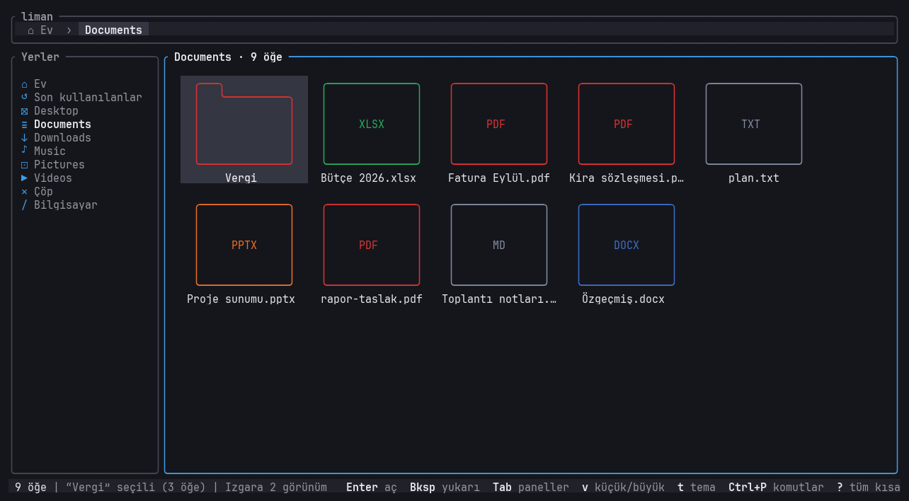
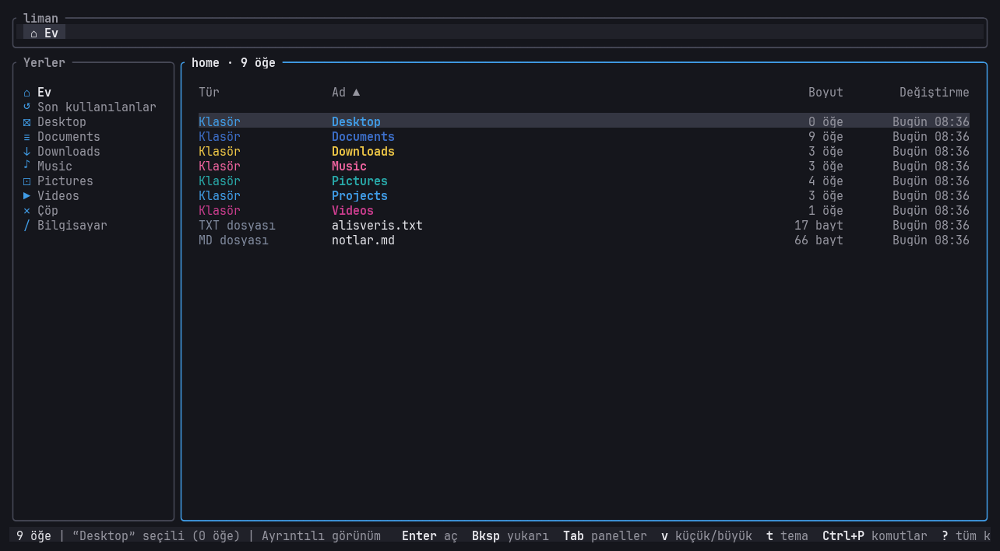

- **+ / -** ya da **Ctrl+tekerlek** kutu boyutunu değiştirir; pencere küçülünce liman sığan en büyük görünüme kendisi geçer.
- **Ayrıntılı** görünüm dar bir panelde (ör. önizleme açıkken) adlara yer açmak için önce Değiştirme, sonra Tür sütununu gizler.
- **Ayrıntılı** görünümde sütun başlığına tıklamak o sütuna göre sıralar, tekrar tıklamak ters çevirir. Klavyede **s** (sonraki
  sütun) ve **S** (ters). Sıralama hatırlanır.
- **Ctrl+H** ya da **.** gizli dosyaları gösterir/gizler (hatırlanır).

## Gezinme

| Tuş | Ne yapar |
|---|---|
| **↑ ↓** (ızgarada **← →** de) | seçimi oynatır |
| **Enter** / çift tık | klasöre gir, dosyayı aç |
| **Bksp**, **Alt+←**, **Alt+↑** | üst klasör |
| **Alt+→** | seçili klasöre gir |
| **Alt+↓** | seçili öğeyi aç |
| **Ctrl+← / Ctrl+→** | geri / ileri (tarayıcıdaki gibi geçmiş) |
| **~** | Ev klasörü |
| **Home / End**, **PgUp / PgDn** | başa, sona, sayfa sayfa |

- Bir klasöre geri dönünce en son seçtiğin öğe yine seçili gelir.
- Dosya açmak: masaüstündeysen varsayılan programla açılır; SSH'deysen (ekran yoksa) `$EDITOR` ile terminalde açılır.
- **Ctrl+D** bulunduğun klasörü yer imlerine ekler (Yerler'de ★), tekrar basınca çıkarır. **Son kullanılanlar**, liman'dan
  açtığın dosyaların listesidir.

## Seçme

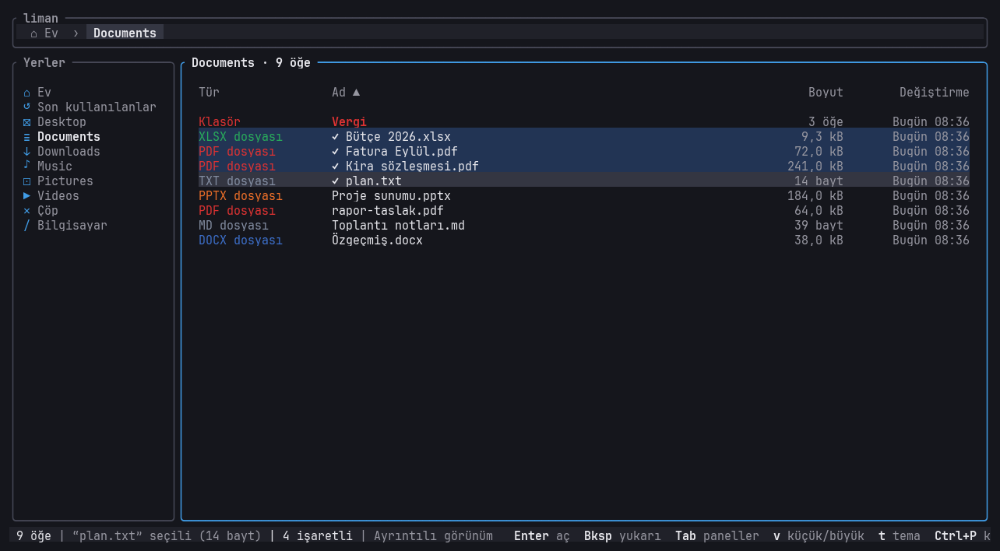

| Nasıl | Ne |
|---|---|
| **Space** | işaretle / kaldır ve bir alta in |
| **Ctrl+Space** | işaretle / kaldır, imleç yerinde kalsın |
| **Shift+↑↓** (ızgarada **Shift+←→** de), **Shift+Home/End**, **Shift+PgUp/PgDn** | Shift'e bastığın yerden imlece kadar aralık |
| **Ctrl+tık** | tek tek işaretle |
| **Shift+tık** | son tıkladığın yerden buraya kadar |
| **Ctrl+A** | hepsi |

İşaretli öğeler ✓ ile ve renkli arka planla görünür, durum çubuğunda "4 işaretli" yazar. Kopyala, kes, çöpe at, sürükle ve
Alt+Enter işaretlilerin hepsine uygulanır; hiçbiri işaretli değilse imlecin üstündeki öğeye.

## Dosya işlemleri

| Tuş | Ne |
|---|---|
| **Ctrl+C / Ctrl+X / Ctrl+V** | kopyala / kes / yapıştır |
| sürükle-bırak | klasörün ya da Yerler'deki bir yerin üstüne bırak: taşır; **Ctrl** basılıysa kopyalar |
| **F2** | yeniden adlandır |
| **Ctrl+N** | yeni klasör (hemen adını yazdırır) |
| **Del** | çöpe at (geri alınabilir) |
| **Shift+Del** | kalıcı sil (önce sorar) |
| **Ctrl+Z** | son işlemi geri al (kopyalama, taşıma, yeniden adlandırma, çöpe atma...) |
| **Alt+C** | yolu panoya kopyala (SSH üstünden de, terminalin panosuna) |

- Yapıştırırken aynı adda dosya varsa sorar: **b** ikisini de tut (Enter), **r** üzerine yaz (eskisi çöpe), **s** atla.

  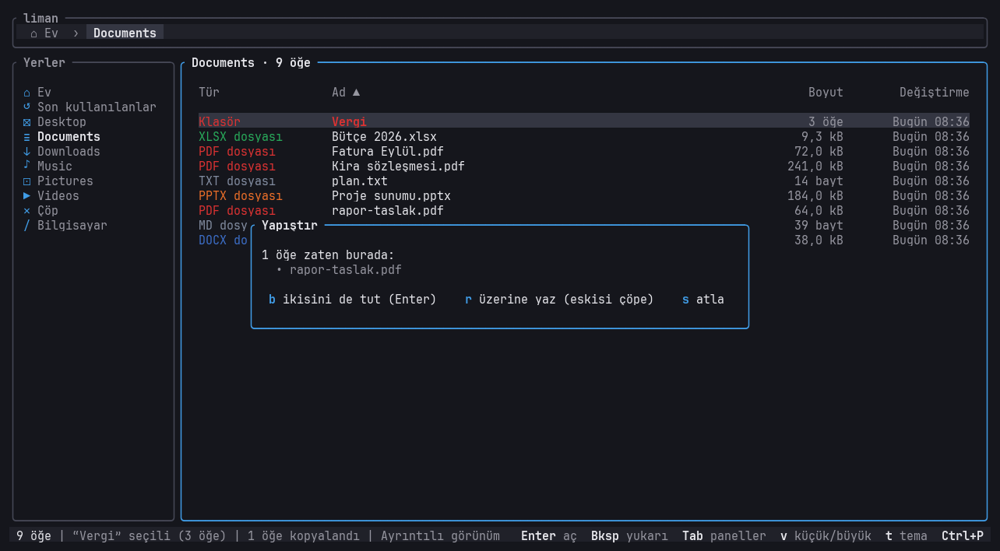
- Uzun işlemlerde durum çubuğunda yüzde görünür; işlem bitene kadar ikinci bir işlem başlatılmaz.
- Başka bir program (ya da terminalde `touch`, `rm`) klasörü değiştirirse liste kendiliğinden güncellenir.

## Arama ve süzme

- **/** ile yazmaya başla: bu klasördeki adlar süzülür. **Enter** süzgeci tutar, **Esc** temizler.
- **Ctrl+F**: bu klasörde ve **altındaki tüm klasörlerde** ada göre arar, sonuçları bir liste olarak gösterir.
  Yol çubuğunda `⌕ arama "…" · 12 öğe bulundu` yazar; **Bksp / Esc** klasöre geri döner.

  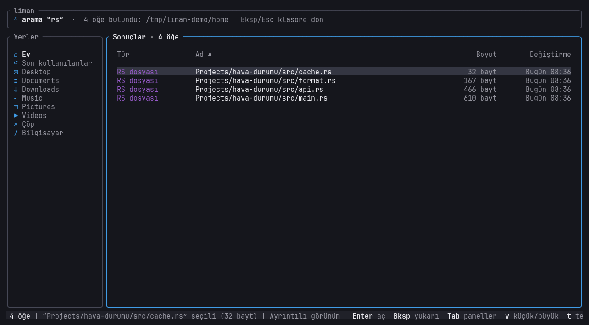

## Önizleme ve okuyucu

**F3** sağda önizleme panelini açar/kapatır (hatırlanır).

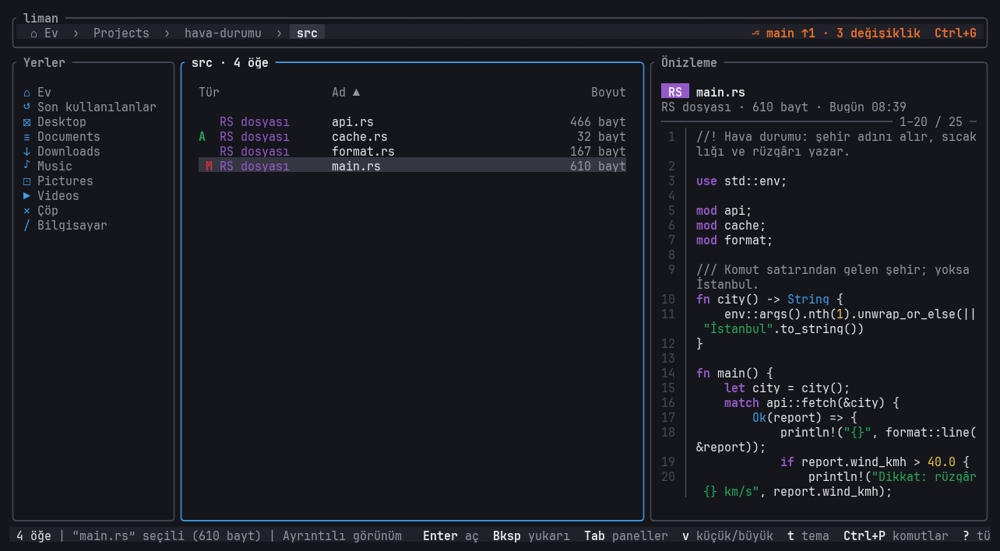

| Ne seçiliyse | Önizlemede |
|---|---|
| kod (rs, py, js, sh, toml...) | renkli: anahtar sözcükler, metinler, sayılar, yorumlar |
| Markdown | başlıklar, listeler, `kod`, bağlantılar biçimli |
| düz metin | satır numaralı, uzun satırlar alta kayar |
| klasör | kaç öğe, hangi türden ne kadar (renkli çubuklar), içindekiler |
| resim (png, jpg, gif, webp) | resmin kendisi, terminal hücreleriyle |
| PDF | metni (`pdftotext` kuruluysa) |
| arşiv (zip, tar.gz...) | içindekiler (`unzip` / `tar` kuruluysa) |

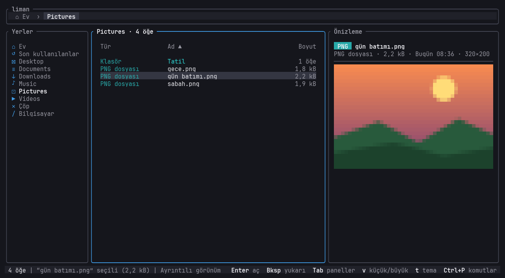

- Panel açıkken **Tab** ile önizlemeye geç: **↑↓ / j k** satır, **PgUp/PgDn** ya da **Space** sayfa, **g / G** baş / son.
  Çizginin sağında hangi satırları gördüğün yazar (`12–40 / 300`).
- **Enter** (önizlemede) ya da **r** (dosya listesinde): **tam ekran okuyucu**. **Esc** geri döner.

  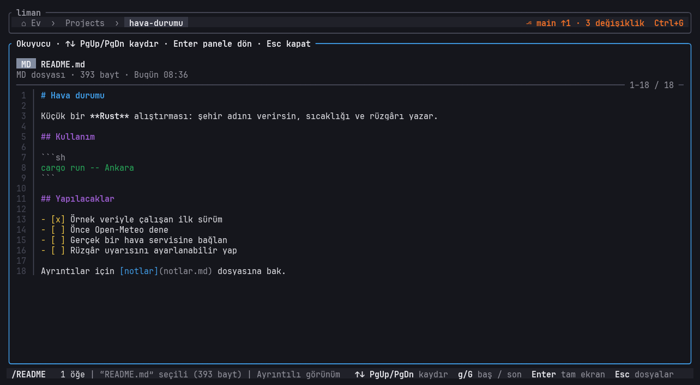
- Önizleme fare tekerleğiyle de kayar. 1 MB / 20.000 satıra kadar okunur.

## Terminal

**F4** altta gerçek kabuğunu açar (fish, bash, zsh — ne kullanıyorsan).

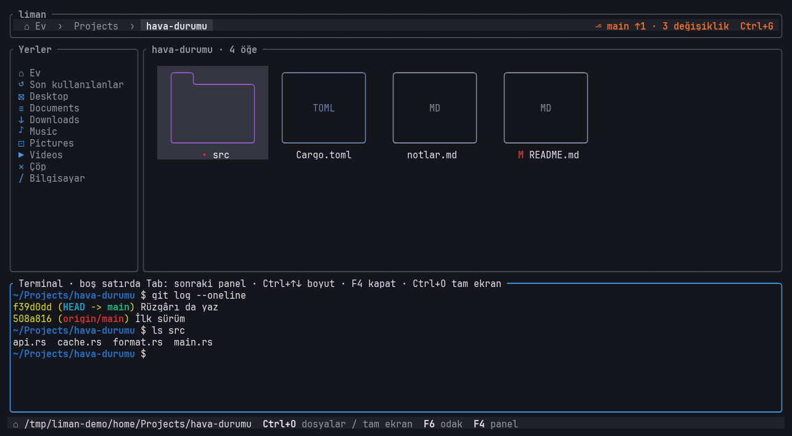

- **Tab** terminale geçer, terminalde boş satırda **Tab** dosyalara döner (yazı varken Tab kabukta tamamlama yapar).
  **F6** de odak değiştirir. **Ctrl+O** tam ekran yapar / geri alır. **Ctrl+↑ / Ctrl+↓** panelin boyu (ya da üst kenarını sürükle).
- **İki yönlü klasör takibi:** terminalde `cd` yapınca üstteki görünüm o klasöre gider; üstte klasör değiştirince kabuk da gelir.
- **Komut sonuçları yukarıda:** `find . -name '*.rs'`, `fd`, `rg -l`, `ls` gibi dosya adı yazan bir komut çalıştırınca bulunan
  dosyalar üstte liste olarak görünür; seçip açabilir, kopyalayabilirsin. **Bksp / Esc** klasöre döner.

  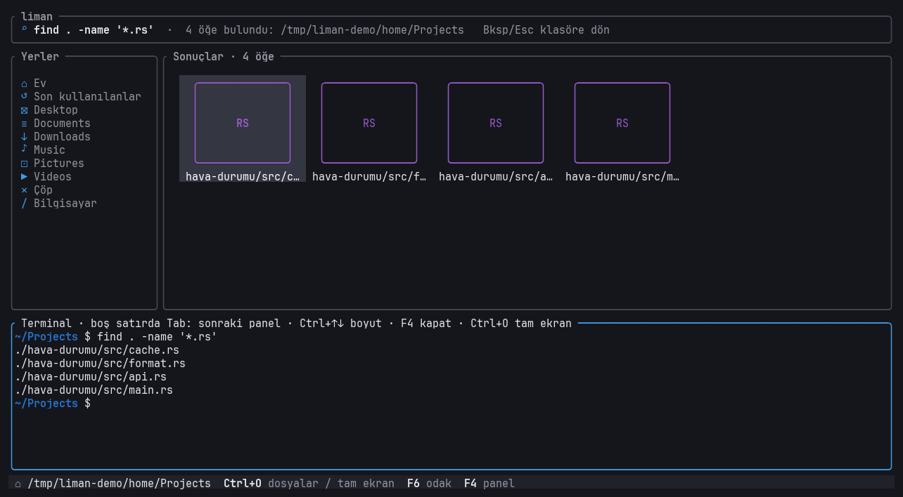
- **Alt+Enter**: seçili (ya da işaretli) dosyaların yolunu tırnaklı olarak komut satırına yazar — `mv`, `cp`, `git add` öncesi işe yarar.

## Sekmeler

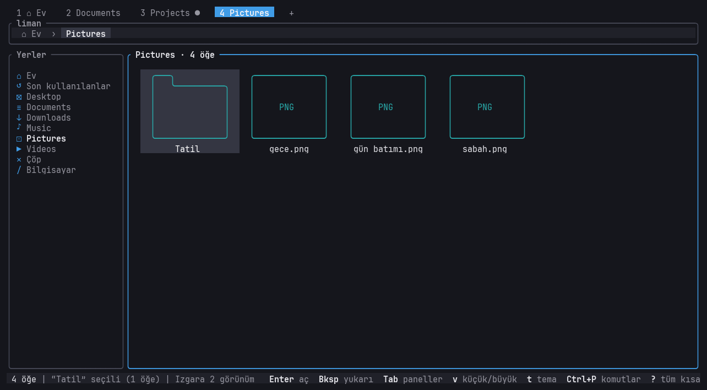

- **Ctrl+T** yeni sekme (aynı klasörde), **Ctrl+W** kapat (son sekme kapanmaz).
- **Alt+1…9** o numaralı sekmeye geçer (terminaldeyken de). **Sekme satırının üstünde fare tekerleği** sekmeler arasında gezer.
- **Klasöre orta tık** (tekerleğe basmak): o klasörü arka planda yeni bir sekmede açar, sen olduğun yerde kalırsın.
  **Sekmeye orta tık**: kapatır. **+**: yeni sekme.
- Her sekmenin kendi klasörü, geçmişi, seçimi, işaretleri ve **kendi terminali** vardır; `●` o sekmede açık bir kabuk olduğunu
  gösterir. Arka plandaki sekmenin kabuğunda çalışan komut durmaz.
- Pano, geri alma, görünüm, tema ve sıralama sekmeler arasında **ortaktır**: bir sekmede kopyalayıp öbüründe yapıştırabilirsin.
- Sekmeler kaydedilmez; liman kapanıp açılınca tek sekmeyle başlar.

## Git

Yalnızca bir git deposunun içindeyken görünür.

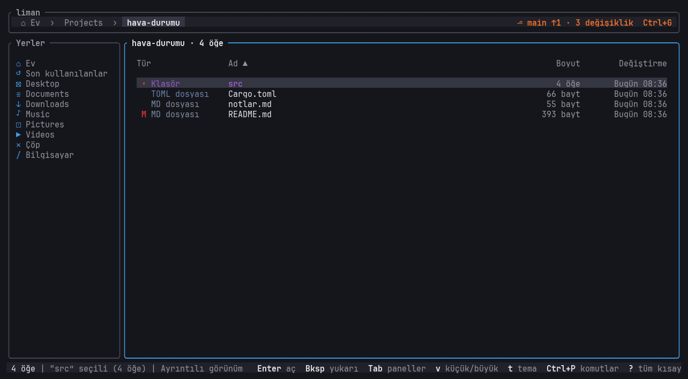

- **Tür sütununda (Ayrıntılı görünüm) ya da adın önünde iki harf:** 1. harf **yeşil** = commit'e hazır (stage'li) değişiklik,
  2. harf **kırmızı** = henüz hazırlanmamış değişiklik. `M` değişmiş, `A` eklenmiş, `D` silinmiş, `R` adı değişmiş,
  sarı `?` git'in takip etmediği yeni dosya, `!!` çakışma. Klasörün önünde kırmızı **`•`**: içinde (derinde de olabilir) değişiklik var.
- **Yol çubuğunun sağında:** `⎇ main ↑2 ↓1 · 5 değişiklik` — dal, GitHub'dan ileride (↑) / geride (↓) olan commit sayısı.
- **Ctrl+G — git paneli:**

  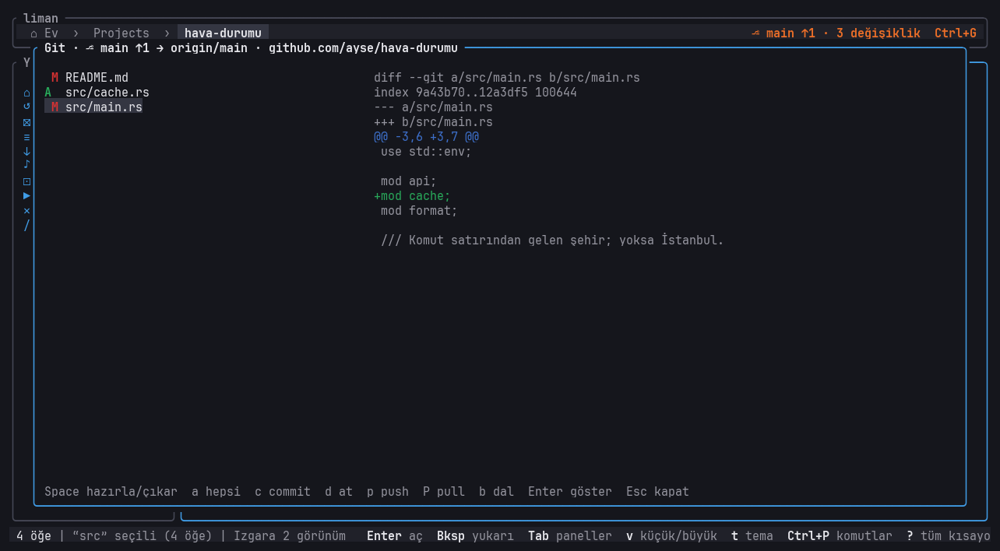

  Başlıkta push'un nereye gideceği yazar: `⎇ main → origin/main · github.com/kullanici/repo`. Solda değişen dosyalar,
  sağda seçili dosyanın farkı (`+` eklenen yeşil, `-` silinen kırmızı satırlar).

  | Tuş | Ne |
  |---|---|
  | **↑↓** | dosya seç (**J / K** farkı kaydırır) |
  | **Space** | seçili dosyayı stage'e ekle / çıkar |
  | **a** | hepsini stage'e ekle |
  | **c** | commit mesajı yaz, Enter ile commit |
  | **p** | push (commit'leri GitHub'a gönder; yeni dalda `-u` ile ilk kez) |
  | **P** | pull (yalnızca hızlı ileri sarma; birleştirme gerekirse terminalde) |
  | **d** | değişikliği geri at (sorar; yeni dosyalar silinmez, çöpe gider) |
  | **b** | dal değiştir |
  | **Enter** | dosyayı listede göster |
  | **Esc** | kapat |

- **Push nereye gider?** liman adres seçmez: deponun kayıtlı uzak adresine (`git clone` ile geldiyse ya da
  `git remote add origin <link>` yazdıysan `origin`) gider. Dosya değil commit gönderilir: önce Space ile hazırla, c ile commit at, sonra p.

## Komut paleti ve sağ tık

- **Ctrl+P**: tüm komutlar, yazarak ara. Türkçe ya da İngilizce yazabilirsin ("kopyala" da "copy" de bulur). Yanında kısayolu yazar.

  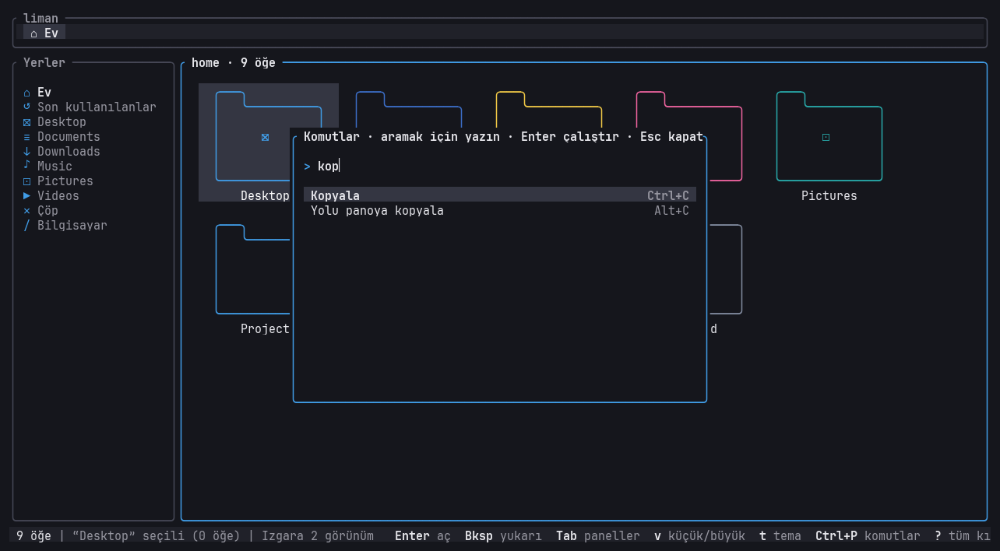
- **Sağ tık**: o öğe için menü (Aç, Kopyala, Kes, Yeniden adlandır, Çöpe at, Burada terminal aç, Yolu kopyala...).
- **?**: tüm kısayolların listesi.

## Renkler ve temalar

- Her dosya türünün bir rengi var: kod mor, PDF kırmızı, tablo yeşil, sunum turuncu, arşiv sarı, resim turkuaz...
- **Klasörler içlerinde ne varsa onun rengindedir:** dosyalarının en az yarısı kodsa kod renginde, Markdown'sa metin renginde.
  Müzik, Resimler, Videolar, Belgeler her zaman kendi renklerinde. Karışık ya da boş klasörler mavi.
- **t**: tema seçici — 8 tema (liman, nord, gruvbox, catppuccin, tokyo-night, dracula, rose-pine, light); gezinirken canlı
  önizler, **Enter** seçer, **Esc** vazgeçer.

  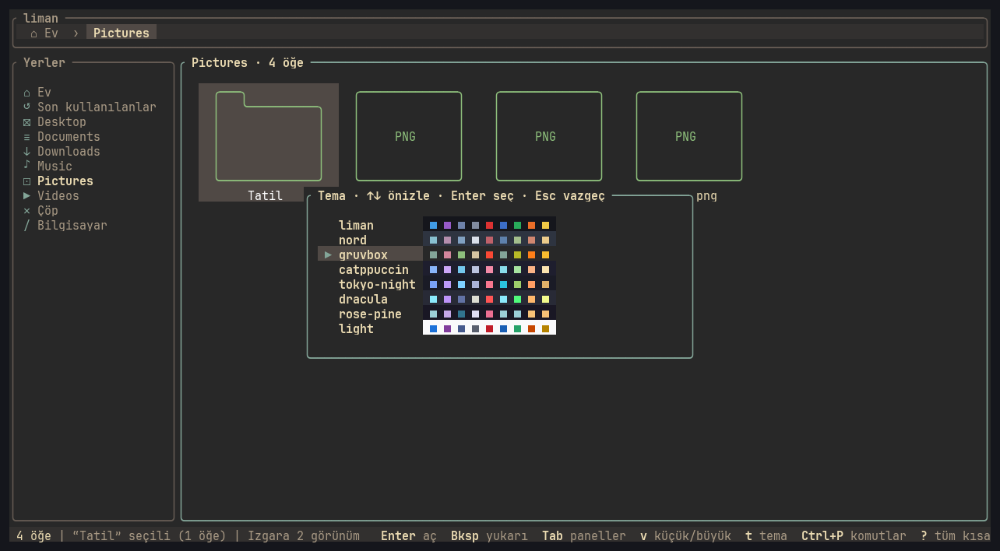
- Terminal truecolor desteklemiyorsa (bazı SSH/tmux kurulumları) renkler kendiliğinden en yakın 256 renge çevrilir.

## Ayarlar

`~/.config/liman/config`, satır başına bir `anahtar = değer`. Çoğu liman içinden değiştirilince kendisi yazılır.

| Anahtar | Değerler | Nereden |
|---|---|---|
| `theme` | liman, nord, gruvbox, catppuccin, tokyo-night, dracula, rose-pine, light | **t** |
| `lang` | `tr`, `en` (yoksa sistem dilinden) | elle |
| `colors` | `truecolor`, `256` (yoksa tahmin) | elle |
| `hidden` | `true`, `false` | **Ctrl+H** |
| `sort` | `name`, `size`, `modified`, `type`, sonuna `-desc` | **s / S** |
| `preview` | `true`, `false` | **F3** |

Yer imleri: `~/.config/liman/bookmarks` (satır başına bir klasör).

## Tüm kısayollar

liman içinde **?** her zaman güncel listeyi gösterir.

| Tuş | Ne |
|---|---|
| Enter / çift tık | aç |
| Bksp / Alt+← / Alt+↑ | üst klasör |
| Alt+→ / Alt+↓ | klasöre gir / aç |
| Ctrl+← / Ctrl+→ | geri / ileri |
| Tab / Shift+Tab | Yerler · Dosyalar · Önizleme · Terminal |
| v | küçük liste ↔ büyük görünüm |
| + / - (Ctrl+tekerlek) | büyüt / küçült |
| / | süz |
| Ctrl+F | alt klasörlerde ara |
| Ctrl+D | yer imi ekle / kaldır |
| Ctrl+H / . | gizli dosyalar |
| s / S (başlığa tık) | sırala / ters çevir |
| Space / Ctrl+A | işaretle / tümünü işaretle |
| Ctrl+Space | işaretle, imleç yerinde |
| Ctrl+tık / Shift+tık | tek / aralık işaretle |
| Shift+oklar / Home / End | aralık işaretle |
| sürükle | taşı (Ctrl: kopyala) |
| Ctrl+C / Ctrl+X / Ctrl+V | kopyala / kes / yapıştır |
| Del / F2 / Ctrl+Z | çöp / yeniden adlandır / geri al |
| Shift+Del | kalıcı sil |
| Ctrl+N / Alt+C | yeni klasör / yolu kopyala |
| Ctrl+T / Ctrl+W | yeni sekme / sekmeyi kapat |
| Alt+1…9 / sekmelerde tekerlek | sekmeye geç |
| klasöre orta tık / sekmeye orta tık | yeni sekmede aç / sekmeyi kapat |
| F3 / r | önizleme paneli / tam ekran oku |
| F4 / Ctrl+O / F6 | terminal paneli / tam ekran / odak |
| Ctrl+↑ / Ctrl+↓ | terminal boyu |
| Alt+Enter | seçili yolları terminale yaz |
| Ctrl+G | git paneli |
| Ctrl+P / sağ tık | komut paleti / menü |
| t | tema |
| ~ | Ev |
| ? / q | kısayollar / çık |
